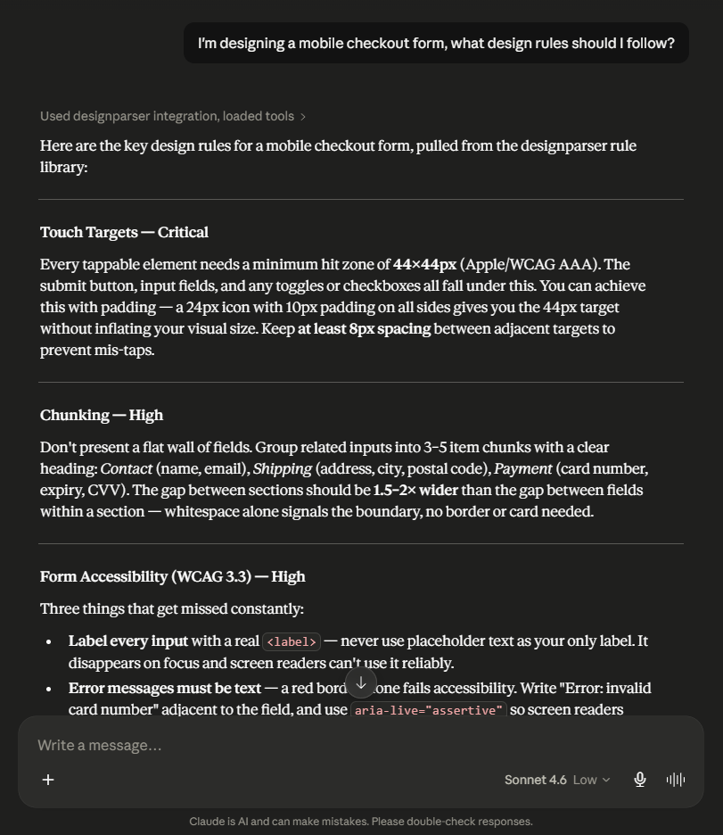
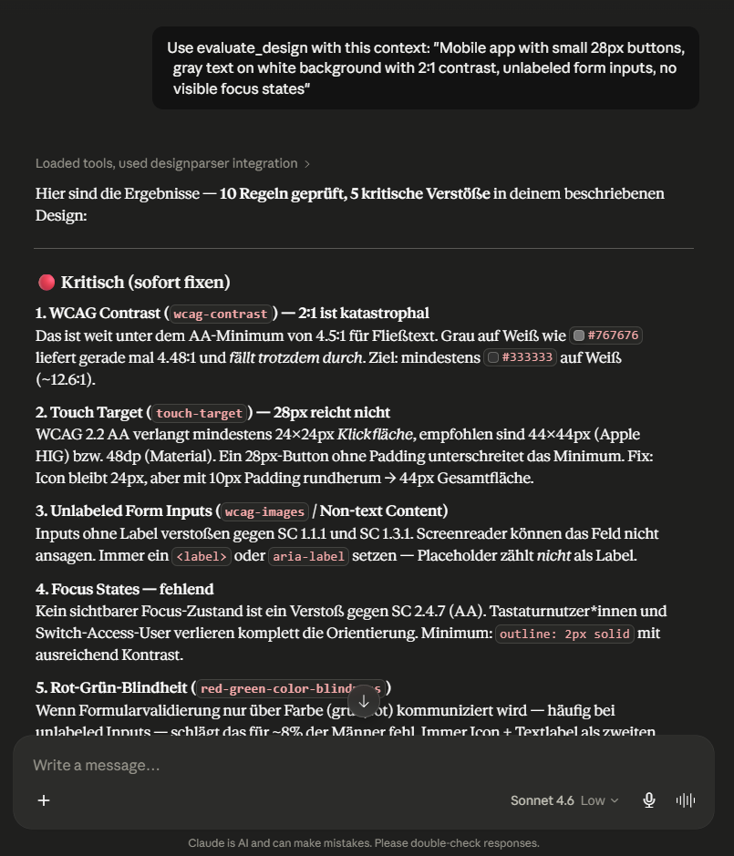

# designparser-mcp

**Design rules as an MCP server.** Connect Claude, Cursor, or Windsurf to a structured, evidence-backed design knowledge base — and get design guidance directly in your AI workflow.

By [designparser](https://designparser.de) — *Parsed, not guessed.*

---

## What it does

77 design rules across 14 categories, available as AI tools. Every rule has a TL;DR, practical guidance with concrete values, key numbers, and verifiable sources.

**Example:**
> *"I'm designing a mobile navigation. What rules apply?"*
> → returns touch-target minimums, Miller's Law, Hick's Law, WCAG navigation requirements — prioritized, with practical CSS values and sources

**Categories:** `color` · `typography` · `spacing` · `layout` · `shadows` · `ux-laws` · `interaction` · `icons` · `visual` · `motion` · `forms` · `navigation` · `media` · `print`

---

## Install — Claude Desktop

Add to your `claude_desktop_config.json`:

```json
{
  "mcpServers": {
    "designparser": {
      "command": "npx",
      "args": ["-y", "designparser-mcp"]
    }
  }
}
```

**Config file location:**
- macOS: `~/Library/Application Support/Claude/claude_desktop_config.json`
- Windows: `%APPDATA%\Claude\claude_desktop_config.json`
- Windows (Store): `%LOCALAPPDATA%\Packages\Claude_pzs8sxrjxfjjc\LocalCache\Roaming\Claude\claude_desktop_config.json`

Restart Claude Desktop. Done.

---

## Install — Cursor / Windsurf

Add a new MCP server: command `npx`, args `["-y", "designparser-mcp"]`.

---

## Install — Local / Development

```bash
git clone https://github.com/designparser/designparser-mcp
cd designparser-mcp
npm install
npm run build
npm run validate
```

Point Claude Desktop to your local build:

```json
{
  "mcpServers": {
    "designparser": {
      "command": "node",
      "args": ["/absolute/path/to/designparser-mcp/dist/src/index.js"]
    }
  }
}
```

---

## Tools

| Tool | Description |
|---|---|
| `list_rules` | Browse all rules — filter by category, priority, or tags |
| `get_rule` | Full rule — deep dive, key numbers, sources, video links |
| `get_rules_batch` | Full deep-dive for multiple rules in one call (max 8) |
| `search_rules` | Fuzzy search across all rules and content |
| `suggest_rules_for_context` | Describe your design task → get the relevant rules with practical guidance |
| `evaluate_design` | Describe a UI or paste HTML/CSS → prioritized audit checklist with fixes |

All tools are read-only (`readOnlyHint: true`) — no side effects.

---

## Getting the best results

Claude sometimes answers design questions from training data instead of the MCP — especially for well-known topics like WCAG or typography basics.

To force Claude to always use the knowledge base, add this to your Claude Desktop system prompt (Settings → Custom Instructions):

> For any question about design, typography, color, spacing, contrast, accessibility, or UX — always use the designparser MCP tools (`search_rules`, `get_rule`, `suggest_rules_for_context`) to answer. Always cite the rule ID.

**How to tell if the MCP was used:** Claude will show tool calls in the response and cite rule IDs like `wcag-contrast` or `touch-target`. If it answers without any tool badges, it used training data.

---

## Usage examples

```
// Browse all critical rules
"What are the most important rules I should never break?"
→ list_rules priority="critical"

// Browse by category
"Show me all typography rules"
→ list_rules category="typography"

// Browse by tag
"Show me all accessibility rules"
→ list_rules tags=["accessibility"]

// Lookup
"What are the WCAG contrast requirements?"
→ get_rule "wcag-contrast"

// Batch lookup — get multiple rules at once
→ get_rules_batch ids=["wcag-contrast", "touch-target", "millers-law"]

// Search
"What does research say about touch targets?"
→ search_rules "touch target"

// Context-aware — returns rules with practical guidance inline
"I'm designing a mobile navigation bar. What rules apply?"
→ suggest_rules_for_context "mobile navigation bar"

// Evaluate
"Here's my button CSS — what am I getting wrong?"
[paste CSS]
→ evaluate_design

// Focused audit
"I'll describe what I see in this dashboard screenshot — audit accessibility"
→ evaluate_design focus="accessibility"
```

---

## How `suggest_rules_for_context` works

Describe what you're designing and the tool returns the most relevant rules — ranked by priority, with TL;DR, practical guidance (→), and key numbers inline. No follow-up `get_rule` calls needed for most tasks.



---

## How `evaluate_design` works

Describe the design (or paste HTML/CSS) — the tool returns a prioritized checklist sorted critical → high → medium → low. Each item includes the rule ID, what to check, the practical fix, and the key number where applicable.

Claude applies the checklist to your actual design. The MCP provides the knowledge; the AI does the evaluation. No fake scoring.



---

## Rules

All rules are in `rules/<category>/<rule-id>.md`. Each rule includes:

| Field | Description |
|---|---|
| `id` | Kebab-case identifier |
| `title` | Rule name |
| `category` | One of 14 categories |
| `priority` | `critical` / `high` / `medium` / `low` |
| `tldr` | One-sentence summary |
| `tags` | Platform and context tags for better search and filtering |
| `related_rules` | IDs of related rules |
| `sources` | Verifiable references with year |
| Body sections | The Rule · Why · When It Breaks · In Practice · Key Numbers |

---

## Contributing

This is a community project. The code is open, the rule content is curated by designparser.

**Ways to contribute:**
- **Suggest a rule** — open an issue with the "Suggest a rule" template
- **Report an error** — open a "Bug report" issue with the rule ID
- **Submit a rule** — copy `RULE_TEMPLATE.md`, follow the checklist, open a PR
- **Improve the code** — search, tools, CI — open an issue first for larger changes

Every PR runs automated validation — schema errors block merging, so check locally first with `npm run validate`.

See [CONTRIBUTING.md](CONTRIBUTING.md) for full details.

---

## License

Code: MIT
Rule content: © designparser — see [LICENSE](LICENSE)

Rules may be used freely in your own projects. They may not be republished as standalone datasets.

---

Made by [designparser](https://designparser.de)
